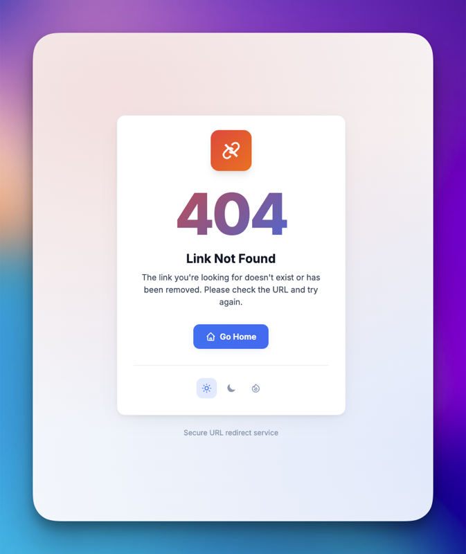
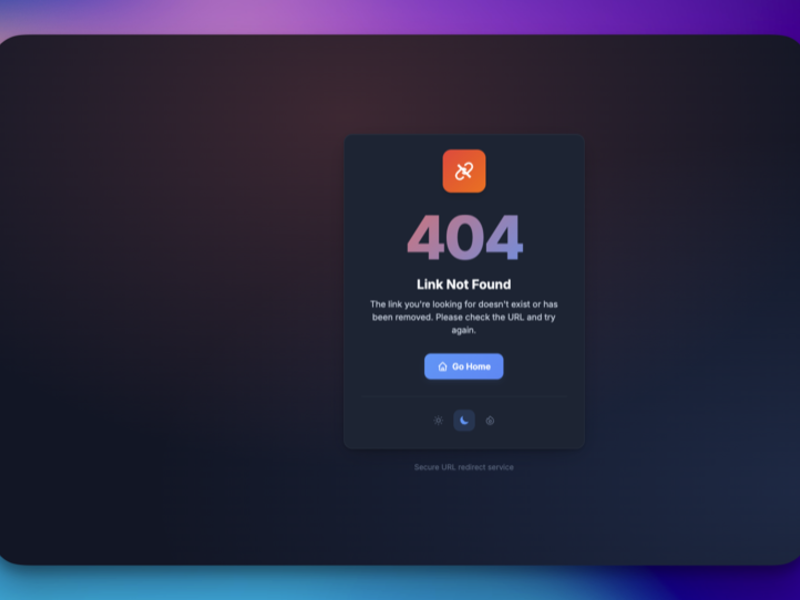
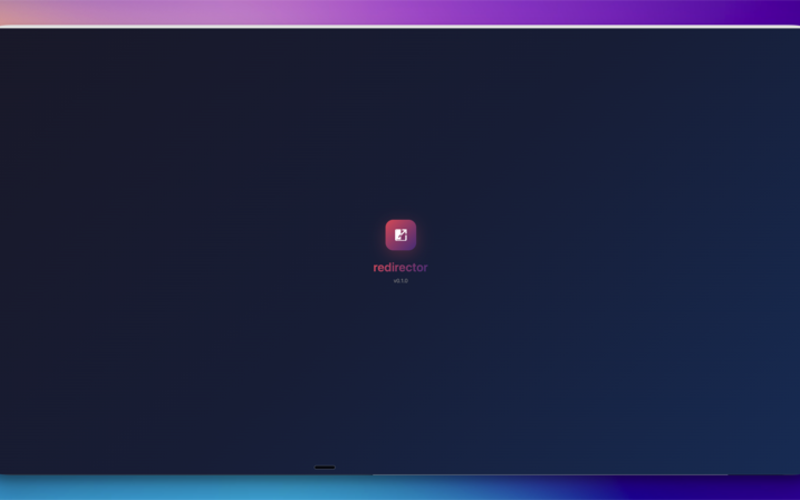
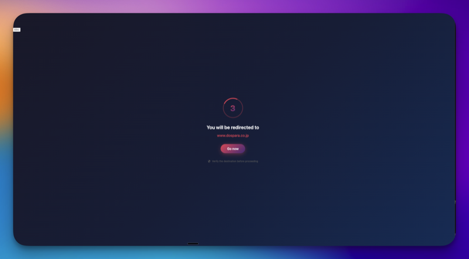

# redirector

[English](../README.md) | [Русский](README.ru.md) | [中文](README.zh.md) | [हिंदी](README.hi.md) | [Español](README.es.md) | [Português](README.pt.md) | [Français](README.fr.md) | [Deutsch](README.de.md) | [日本語](README.ja.md) | [한국어](README.ko.md) | [Polski](README.pl.md) | [Nederlands](README.nl.md) | [Italiano](README.it.md) | **Türkçe** | [Українська](README.uk.md) | [Bahasa Indonesia](README.id.md) | [Tiếng Việt](README.vi.md) | [Svenska](README.sv.md) | [Suomi](README.fi.md)

[](https://github.com/brilliant-almazov/redirector/actions/workflows/ci.yml)
[](https://github.com/brilliant-almazov/redirector)
[](https://opensource.org/licenses/MIT)

[](https://github.com/brilliant-almazov/redirector)
[](https://github.com/brilliant-almazov/redirector)
[](https://github.com/brilliant-almazov/redirector)

Ara sayfalar ve hashid tabanlı kısa bağlantılarla güvenli URL yönlendirme hizmeti.

## Problem

Uzun URL'leri paylaşmak zahmetlidir. URL kısaltıcılar mevcut ancak çoğu zaman hemen yönlendirir, bu da güvenlik riski oluşturabilir. Kullanıcılar yönlendirilmeden önce nereye gittiklerini görebilmelidir.

**redirector** güvenli yönlendirmeler sağlar:
- Yönlendirmeden önce hedef URL'yi gösteren ara sayfa
- Kullanıcı farkındalığı için geri sayım
- Güzel, markalı sayfalar

## Özellikler

- 🔗 **Hashid URL'ler** - Kısa, benzersiz, sıralı olmayan ID'ler (ör. `/r/abc123`)
- ⏱️ **Ara sayfa** - Yönlendirmeden önce hedef URL'yi gösteren geri sayım
- ⚡ **Redis önbellekleme** - Yapılandırılabilir TTL ile hızlı aramalar
- 🛡️ **Devre kesici** - Zincirleme hatalara karşı veritabanı koruması
- 🚦 **Hız sınırlama** - Küresel ve veritabanı seviyesinde limitler
- 📊 **Prometheus metrikleri** - Basic Auth korumalı tam gözlemlenebilirlik
- 🎨 **Güzel sayfalar** - Temiz 404 ve dizin sayfaları
- 🔑 **Çoklu tuzlar** - Geçiş için hashid tuz rotasyonu desteği

## Ekran Görüntüleri

| Açık | Koyu | Sıcak |
|------|------|-------|
|  |  |  |
|  |  |  |
|  |  |  |

| Ana Sayfa | Ara Sayfa |
|-----------|-----------|
|  |  |

## Teknoloji Yığını

- **Dil**: Rust (Tokio ile async)
- **Web Framework**: Axum
- **Önbellek**: Redis-compatible (Redis, Dragonfly, Valkey, KeyDB)
- **Veritabanı**: PostgreSQL (takılabilir depolama katmanı)
- **Metrikler**: Prometheus + metrics-rs
- **Şifre Hashleme**: Argon2

> **Not**: PostgreSQL varsayılan depolama arka ucu olarak kullanılır. Depolama katmanı soyutlanmıştır ve herhangi bir veri kaynağı ile değiştirilebilir. Şu anda aktif geliştirme aşamasındadır.

## Hızlı Başlangıç

### Docker

```bash
docker run -p 8080:8080 \
  -v $(pwd)/config.yaml:/config.yaml \
  ghcr.io/brilliant-almazov/redirector:latest
```

## Endpointler

| Endpoint | Yetki | Açıklama |
|----------|-------|----------|
| `GET /` | Hayır | Ana sayfa |
| `GET /r/{hashid}` | Hayır | Ara sayfa ile yönlendirme |
| `GET /health` | Hayır | Sağlık kontrolü |
| `GET /metrics` | Basic | Prometheus metrikleri |
| `GET /admin` | Oturum | Yönetim paneli girişi |
| `GET /admin/dashboard` | Oturum | Yönetim paneli |

## Yönetim Paneli

Servis, canlı metrikleri izlemek için isteğe bağlı bir yönetim paneli içerir.

### Kurulum

1. **Şifre hash'i oluşturun:**

```bash
cargo run --bin hash_password
# İstendiğinde şifreyi girin veya:
cargo run --bin hash_password -- "şifreniz"
```

2. **config.yaml'a ekleyin:**

```yaml
admin:
  enabled: true
  session_ttl_hours: 24
  users:
    - username: admin
      password_hash: "$argon2id$v=19$m=19456,t=2,p=1$..."  # adım 1'den
```

3. **Panele erişin:**

`http://localhost:8080/admin` adresini açın ve kimlik bilgilerinizle giriş yapın.

### Özellikler

- Gerçek zamanlı RPS ve gecikme grafikleri
- Sistem metrikleri (CPU, bellek, çalışma süresi)
- Önbellek isabet oranı izleme
- Son yönlendirmeler listesi
- Test için yük simülasyonu
- Üç tema: Açık, Koyu, Sıcak

## Nasıl Çalışır

1. Kullanıcı `/r/{hashid}` adresini ziyaret eder (ör. `/r/abc123`)
2. Servis hashid'i sayısal ID'ye çözer
3. URL için Redis önbelleğini kontrol eder
4. Önbellek boşsa PostgreSQL'i sorgular
5. Sonucu Redis'te önbelleğe alır
6. Geri sayımlı ara sayfayı gösterir
7. Geri sayımdan sonra hedef URL'ye yönlendirir

## Lisans

MIT Lisansı - detaylar için [LICENSE](../LICENSE) bakın.
